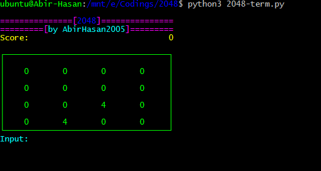

# 2048
This is a Python3 based 2048 Game. Easy to play. Runs with WASD. W = UP, A = LEFT, S = DOWN, D = RIGHT

## There are two 2048 varients in this repository:

### One is 2048.py


2048.py is for Linux, Windows & Mac. Can control with **W = UP, A = LEFT, S = DOWN, D = RIGHT** or **I = UP, J = LEFT, K = DOWN, L = RIGHT**.

### Another is 2048-term.py


2048-term.py is desgined for Termux Users. Can control with **W = UP, A = LEFT, S = DOWN, D = RIGHT, E = EXIT THE SCRIPT**.


### For any help, feedback, updates and chat:
<a href="https://t.me/linux_repo"></a>

## Note:
If you didn't installed Python3, PIP, Git & Modules in your Windows than just download & run the [2048.exe](https://github.com/AbirHasan2005/2048/releases/download/v1.0/2048.exe) file from releases and play.
[](https://github.com/AbirHasan2005/2048/releases)


## Imports:
### From 2048-term.py:
```python
import os
from random import randint
from copy import deepcopy
```

### From 2048.py:
```python
import random
from tkinter import Frame, Label, CENTER
import logic
import constants as c
```

### From logic.py:
```python
import random
import constants as c
```

---

## Setup:
- Linux:
	- `sudo apt install python3 git -y`
	- `git clone https://github.com/AbirHasan2005/2048 && cd 2048`

- Termux:
	- `apt install python git -y`
	- `git clone https://github.com/AbirHasan2005/2048 && cd 2048`

- Windows***(With Python3, PIP3, Git and Modules)***:
	- Install & setup **Python3** on Windows
	- Install & setup **Git** on Windows
	- `git clone https://github.com/AbirHasan2005/2048 && cd 2048`

- Windows***(Without Python3, PIP3, Git and Modules)*** **[Recommanded]**:
	- Download [2048.exe](https://github.com/AbirHasan2005/2048/releases/download/v1.0/2048.exe) file from [releases](https://github.com/AbirHasan2005/2048/releases) and play it easily ;)
	- For any help ask in my [Telegram Group](http://t.me/linux_repo)

## Command(Linux/Termux/Mac):
```bash
python3 2048.py # For Window Mode (For Linux & Mac)
```
```bash
python3 2048-term.py # For Terminal (For Termux, Linux & Mac)
```

## Command(Windows):
```sh
python3 2048.py
```
***If Python3 installed & runs with `python3` command***

## Command(Windows):
```sh
python 2048.py
```
***If Python3 installed & runs with `python` command***


## Load Codes:
- [2048.py](https://github.com/AbirHasan2005/2048/raw/master/2048.py)
- [2048-term.py](https://github.com/AbirHasan2005/2048/raw/master/2048-term.py)
- [contants.py](https://github.com/AbirHasan2005/2048/raw/master/contants.py)
- [logic.py](https://github.com/AbirHasan2005/2048/raw/master/logic.py)

### Don't become a coder by editing my codes. Must give me credits if you use any codes from here.
#### If you find any mistakes in the coding than please report in my [Telegram Group](http://t.me/linux_repo).

---

## FOLLOW ME ON:
<a href="https://github.com/AbirHasan2005"></a> <a href="https://twitter.com/AbirHasan2005"></a> <a href="https://facebook.com/AbirHasan2005"></a> <a href="https://instagram.com/AbirHasan2005"></a>

## DONATE:
[](https://paypal.me/AbirHasan2005)
